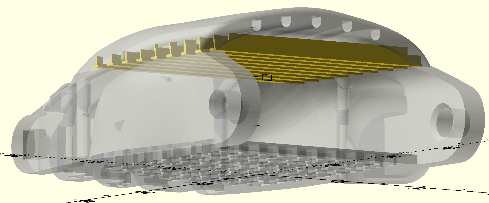
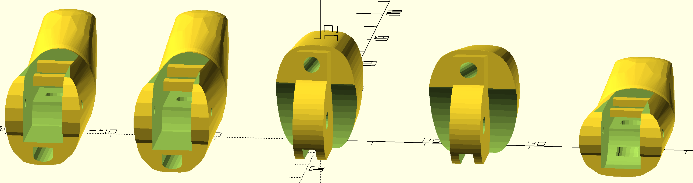

# The Flexible Flyer

## Overview

This repository contains a couple of different but closely related, projects.  It is derived from a mix of the [Phoenix v2](https://www.thingiverse.com/thing:1453190), the [Unlimbited Phoenix v3](https://www.thingiverse.com/thing:1674320), and the [Phoenix Reborn](https://www.thingiverse.com/thing:2217431) hands.

* A new design for supports for the big arch on all three of these palms.  I am providing a completed STL file for these, along with the OpenSCAD code which converts the basic palm into the supported palm.  These supports are flying supports; they do not touch the baseplate.  They are bridged under the top of the arch, and require very little material or time to print.  They break off easily after printing, and remaining nubs can be sanded off.  
* Repaired meshes for the v2 and Reborn palms.  The meshes were run through [Meshmixer](http://www.meshmixer.com) to remove the support box, and then the remaining holes in the mesh were (mostly) closed up.  The Reborn palm, which is derived from the v2 palm, is rederived using OpenSCAD to make the modifications required.
* The big part:  fully parameterized scaling of the v2 and Reborn palms, using OpenSCAD.  
	* 	This allows the palms to be scaled independently of the hinges, so that commercial steel pins or nails can be used to make precision, smooth-operating joints.  
	* The parameters allow selection of different options for both hinge pins and for plastic tubing bearings, which make even better joints.  
	* The clearance on the tongue-and-groove joints is set independently of the scale of the hand.  This way, hands do not become floppier as they scale up to larger size.

## New support system

This support system looks like:
  The goal is a print which is walk-away safe, which can be started, and expected to just work without any close monitoring to make sure the arch finishes safely. If you can print a half-decent bridge, these will work.  It should be printed with quite a lot of cooling, since there is still a significant overhang, but the supports start just low enough that the overhang never becomes dangerous. 

After printing, these supports snap off quite easily.  They leave small 'nubs' on the inside, which sand off very well with a rotary tool such as a Dremel tool with a flap wheel.  They can be removed by hand-sanding, too.

STL Files are provided for left-hand palm of the Unlimbited Phoenix v3, the Phoenix v2, and the regenerated Phoenix Reborn.  Just mirror these in the slicer to get the right-hand version.  Also, an OpenSCAD file for each of these is provided, to allow the supports to be adapted as needed.  The mesh for the Unlimbited palm was regenerated directly from the online Fusion360 source file, to get a higher-resolution mesh.  All of these are designed to be printed flat on the printer bed, with no supports and no raft.

## Parametric Scaling and modification

This is a parametric adaptation of the Phoenix Reborn hand, that allows the primary components (palm and fingers) to be scaled while holding the sizes of the connecting components (finger pins) constant,  so a standard kit of metal connectors can be used, instead of printing plastic pins to connect everything.  The OpenSCAD files allow one to select sizes for whatever connectors are to be used, and then independently scale the palm and fingers.  The connectors can be metal pins of nails, or 3mm screws.  They can have plastic tubing (Delrin or PTFE) wrapping them inside the holes in the phalanx, resulting in a very smooth-operating bearing.

The palm design is a combination of the Phoenix Reborn palm with the fused-in mesh from the Unlimbited V3 palm. This greatly reduces the number of screws required to assemble the hand.  The palm also has new 'flying supports' which solve the problem of the overhang at the top of the palm arch, without printing large support structures. If the integrated mesh is not needed, it can be disabled in OpenSCAD. 

The whole design here is to provide a flexible toolkit to create locally-appropriate variations of the hand, while letting OpenSCAD handle the scaling issues.  Many things can be commented out of the OpenSCAD code to make variations.  For example, if the fused palm mesh isn't desired, the line which fuses it in can be preceded with an asterisk ('*') which tells OpenSCAD to ignore it.  Also, if the new support structure is desired but conventional printed pins are still being used, all the fancy parametric drilling can be turned off, resulting in a (nearly) conventional Reborn hand.

The Reborn-style hand is being recreated in OpenSCAD from the Phoenix v2 palm, by redrilling the tunnels and slots, since it was possible to repair the mesh for the v2 palm to the point where OpenSCAD considered it valid (after removing the support box in MeshMixer).  It has not been possible to date to repair the Reborn palm mesh to the point at which the OpenSCAD openCGAL geometry libraries consider it valid. The file "palm\_left\_v2\_nobox.stl" contains this modified mesh.  

**NOTE**:  any parts not present in the OpenSCAD files are assumed to be obtained from the Phoenix Reborn repository or the Raptor Reloaded repository, which have the gauntlet and other bits.

### Generating the parametric results
You need to run the fingerator.scad to get an STL of a set of fingers at a specific size.  Then run paraglider\_palm\_left.scad to get a hand of the same size, with the same pin specification.  In OpenSCAD, you will unhide the (normally hidden) Customizer window, which will bring up drop-down menus to set the sizes.  I usually start with 130% scale (1.3 size), which is a medium-sized hand.

The fingerator only generates one of each size finger, so for a real hand, these would be duplicated in the slicer to get appropriate numbers.  I would start just by printing one of everything, and experimenting with the parts.  The fingers are much smaller than the palm, of course, so it is not a big issue to print variations on them. Note that if the parts do not fit well, you only have to change the clearance and reprint the phalanges, since they are where the clearances are calculated in.

You also need to run gripper\_box\_pieces.scad to generate the tensioning box scaled for the thermoformed gauntlet.  This result is compatible with simply scaling whippletree\_JD3.stl to the appropriate size in the slicer.

## Progress Log
### October, 2020 update
There is a new OpenSCAD file, paraglider_palm_new_channels.scad.  This file has a better mechanism for filling in the old string channels to get rid if various voids, etc.  It then implements an entirely new system for the channels.  There are two channels for each digit (except the thumb): one for the string and one for the elastic return band.  This should make it easier to thread, using a piece of wire as a leader to puller the strings through. It should also eliminate drag bwtween the two lines.

### Later October, 2020
The entire 'fingerator' module has been replaced. The original used a slice off of the Phoenix finger meshes to start with, and edited from there.  The new fingers are entirely OpenSCAD objects.    They have the following improvements:

* A 'keel' on the overhang to make it _really_ easy to print.  Even without very good cooling,  the distal segment overhang comes out smooth.
* The entire path for the elastic is convered, resulting in better aesthetics. The elastic now passes through from the top if the finger to the bottom, where it gets tied.
* There is a channel to guide the elastic so that it can be inserted in most cases without any  sort of leader to push or pull it through.
* There are two bars under each finger to tie things to, one for the string and one for the elastic.

The goal of these efforts is to produce a hand which gives as stronger grip with less effort from the user, to assist people who do not have a lot of wrist strength.

# Notes from Phoenix Reborn README.txt
*Rest of the text blatantly copied from the Phoenix Reborn file*

This is a Remix of the Phoenix Hand & UnLimbited Arm, designed by Albert Fung. This project is a collaboration between e-NABLE Sierra Leone and the Hong Kong Maker Club.

It became apparent in our previous feasibility study that for the 3D printed prosthetics to survive the tropics, we need to remove components that are not well-adapted to hot weather. We therefore set out to replace all the rubber bands in the Phoenix hand.

Palm: We used the One-Arm palm designed by below_cho as out starting point. All the cable tunnels have been widened, the knuckle stumps removed, and a bar is added at the thumb base for tying elastic cord.

Palm mesh: we have modified the thick palm mesh by John Diamond to strengthen the screw holes.

Fingers: Tunnels have been created so an elastic cord can now run all the way from the finger tip up into the palm.

Pins: For snug fitting, some of the pins have been resized and reshaped.

Hope you'll find this new remix useful!

Ed Choi

## Links:

* [e-NABLE Sierra Leone - Facebook](http://www.facebook.com/enablesierraleone)
* [e-NABLE Sierra Leone - CrowdFunding](http://www.GoFundMe.com/enablesierraleone)
* [Albert Fung - designer](http://albertfung.ca)
* [Hong Kong Maker Club - collaborator](https://www.facebook.com/hongkongmakerclub/) 
* [Raise3D HK Printer - manufacturing](https://www.facebook.com/raise3dhk/)
* [Printact 3D Printer - prototyping ](http://www.printact.co)

## Print Settings

* Rafts: No
* Supports: No
* Infill: 30%
* Walls/top/bottom: 3
* Layer height: 240-320 µm from an 0.4 mm nozzle.  If adaptive layers are available, making the very top of the hand have smaller layers will result in a smoother top.

## Notes: 

For a wrist-powered prosthetic hand, please use the [Reborn Hand thermal gauntlet](http://www.thingiverse.com/thing:864030).
 and tensioner/tensioner pins from the [Raptor Reloaded](http://www.thingiverse.com/thing:596966). 

For an elbow-powered prosthetic arm, please use the Reborn palm with the "forearm" and bicep "cuff" from the UnLimbited Arm (see link). There is a glitch in the Thingiverse Customizer, so you will need to set the UnLimbited "hand length" to at least 145mm. Otherwise the forearm wrist joint would not be wide enough to fit into the palm.
 
http://www.thingiverse.com/thing:1672381
http://www.teamunlimbited.org/the-unlimbited-arm-20-alfie-edition-current/

We printed the Reborn hand at 124% and used it with parametric forearm, cuff and tensioner pins from the UnLimbited Arm(v2.0). From our field experience, the UnLimbited Arm cuff pins are not stronger enough to hold the elbow in place for very long. So we advice everyone to use Chicago/binding screws (glued) instead.

Scaling the ReBorn Hand parts at 124% would give you:

Palm width (widest): 80mm
Wrist joint (outside): 75mm
Wrist joint (inside): 64mm

## Additional materials:

* [Braided fishing line - 80lb.](http://www.ebay.com/itm/KastKing-SuperPower-Braided-Fishing-Line-330-yds-1100yds-SELECT-LB-TEST-/190909992257?var=&hash=item2c731f4d41:m:m6k91tkQ1bIzQbS8tDpHzaQ)
* Elastic cords - 1.5mm - for hands printed at 100% or above
* Screws - for tensioner block - Hands printed at 124%: 
single thread woodscrew 3.0 x 30mm
* Screws - for palm mesh printed at 124%:
Reassure R2 - full thread woodscrew 3.0 x 16mm
* Silicone fingertip grips - Tipper Lee, and superglued to secure them to the fingers
* Velcro - 1 inch thick double-sided
* [Adhesive Foam - 5mm thick](https://www.amazon.co.uk/Self-Adhesive-various-including-padding-Outfitting/dp/B002GUB9R0/ref=sr_1_5?s=sports&ie=UTF8&qid=1491140349&sr=1-5)
* 13mm binding screws for the elbow joints (use superglue or Loctite to prevent loosening). 
* [Loctite 243 seal thread](http://www.ebay.com/itm/121826873262?_trksid=p2057872.m2749.l2648&ssPageName=STRK%3AMEBIDX%3AIT)

