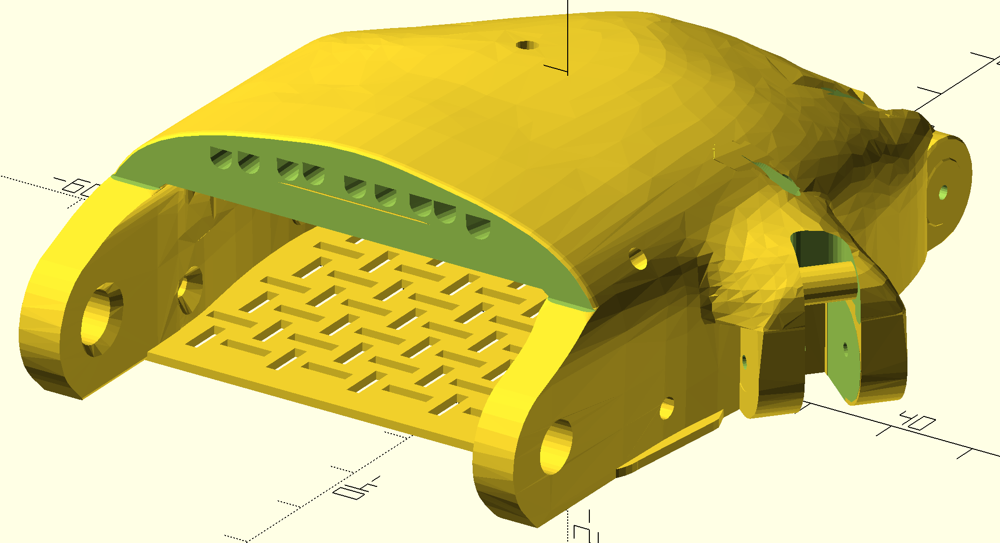
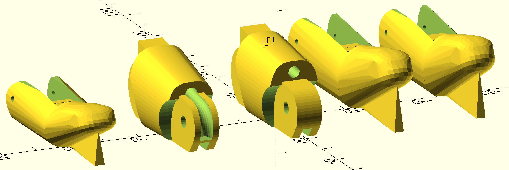
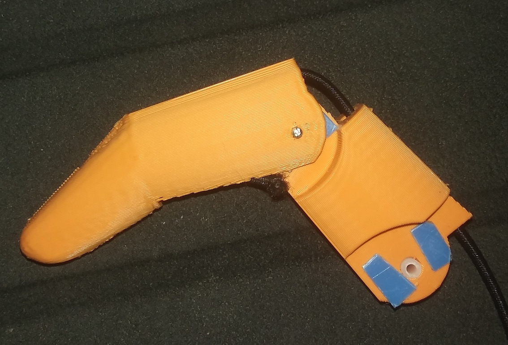

# The Flexible Flyer Progress Log

### October, 2020 update
There is a new OpenSCAD file, paraglider_palm_new_channels.scad.  This file has a better mechanism for filling in the old string channels to get rid if various voids, etc.  It then implements an entirely new system for the channels.  There are two channels for each digit (except the thumb): one for the string and one for the elastic return band.  This should make it easier to thread, using a piece of wire as a leader to puller the strings through. It should also eliminate drag bwtween the two lines. 

### Later October, 2020
The entire 'fingerator' module has been replaced. The original used a slice off of the Phoenix finger meshes to start with, and edited from there.  The new fingers are entirely OpenSCAD objects.  
   They have the following improvements:

* A 'keel' on the overhang to make it _really_ easy to print.  Even without very good cooling,  the distal segment overhang comes out smooth. The keel is easy to break off, and sand the stub away.
* The entire path for the elastic is convered, resulting in better aesthetics. The elastic now passes through from the top of the finger to the bottom, where it gets tied.
* There is a channel to guide the elastic so that it can be inserted in most cases without any  sort of leader to push or pull it through.
* There are two bars under each finger to tie things to, one for the string and one for the elastic.

The goal of these efforts is to produce a hand which gives as stronger grip with less effort from the user, to assist people who do not have a lot of wrist strength.

Here is a picture of an assembled finger, showing the blue Igus self-lubricating tape, the off-white bearing tubing inside a joint, and the assembled joint with a 1/16" steel pin.
 

