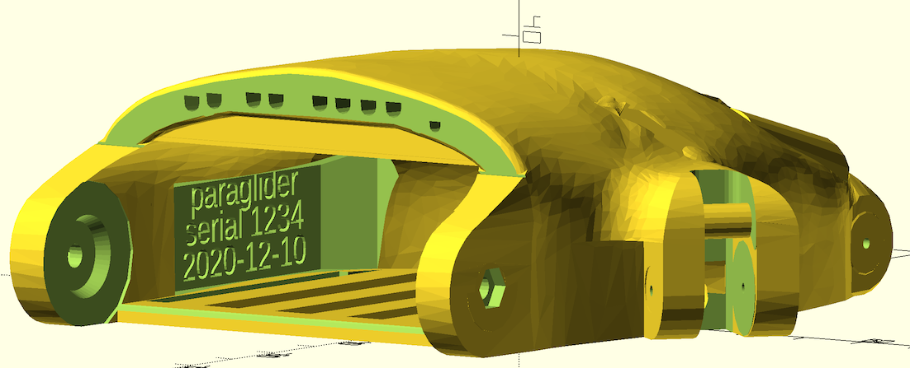

# The Paraglider Progress Log
## Mid-December 2020
### Wrist joint
The work on a wrist joint using an m3 screw instead of a plastic pin is complete.  The joint has a conical thrust/axial bearing printed in, so the scre is not the actual axle.  It can be assembled without any bearing material, or can either have something like polypropylene sheet inserted to lower friction, or it can use the non-adhesive Igus plastic I have described elsewhere.  If using the Igus plastic, I have included an option to print a thermoforming jig which allows the plastic to be heated, and then stamped and drilled using the jig.

### Labeling text
To allow hands to be traced and recorded, I have added the ability to print 3 lines of text on the inside of the hand.  These might include the maker name, a serial number, and a date.  Whatever you wa t...

### Here it is

This shows the current wrist and text design.

## Early November, 2020

### Name change (sort of) to "paraglider"
It has been decided that this project will adopt the "paraglider" name, since "flexible flyer" makes it appear it might be a flexure-joint based project.  Some files and materials will keep the old name, though.

### New!  Unlimbited V3 palm 
It is now also possible to build the parametric palm against the [Unlimbited Phoenix V3](https://www.thingiverse.com/thing:1674320)  palm, which is somewhat different.  Everything works almost the same, but the passages (especially the thumb string) are quite different. Everything should be compatible, although I have not yet tested the thumb.  The positioning of the thumb socket is different on this palm, and it may require a slightly different parametric scaling of the thumb. Use paraglider_palm_unlimbited_v3.scad and its customizer script to use this.

### Reborn palm progress
Much cleanup has been carried out on the palm based on the Phoenix Reborn project.  

## Later October, 2020
The entire 'fingerator' module has been replaced. The original used a slice off of the Phoenix finger meshes to start with, and edited from there.  The new fingers are entirely OpenSCAD objects.  
   They have the following improvements:

* A 'keel' on the overhang to make it _really_ easy to print.  Even without very good cooling,  the distal segment overhang comes out smooth. The keel is easy to break off, and sand the stub away.
* The entire path for the elastic is convered, resulting in better aesthetics. The elastic now passes through from the top of the finger to the bottom, where it gets tied.
* There is a channel to guide the elastic so that it can be inserted in most cases without any  sort of leader to push or pull it through.
* There are two bars under each finger to tie things to, one for the string and one for the elastic.

The goal of these efforts is to produce a hand which gives as stronger grip with less effort from the user, to assist people who do not have a lot of wrist strength.

Here is a picture of an assembled finger, showing the blue Igus self-lubricating tape, the off-white bearing tubing inside a joint, and the assembled joint with a 1/16" steel pin.
 

## October, 2020 update
There is a new OpenSCAD file, paraglider\_palm\_new\_channels.scad.  This file has a better mechanism for filling in the old string channels to get rid if various voids, etc.  It then implements an entirely new system for the channels.  There are two channels for each digit (except the thumb): one for the string and one for the elastic return band.  This should make it easier to thread, using a piece of wire as a leader to puller the strings through. It should also eliminate drag bwtween the two lines. 

